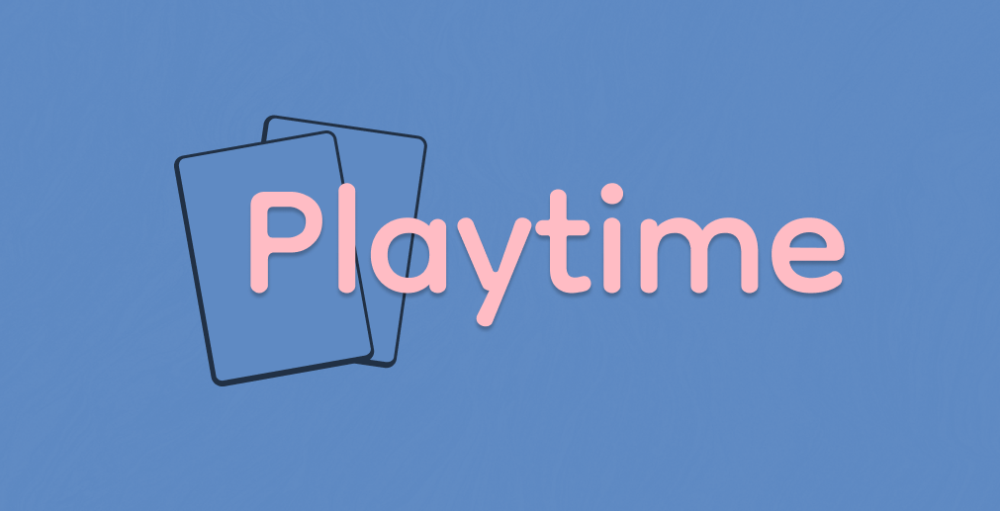

🃏 Playtime.nvim
==

A collection of (mostly card) games for Neovim that I (mostly) like.

> Playtime is a bit of a toy and currently does not have semver releases.
> Configuration options, stats and included games may change or disappear.
> Some interface or interactions may be wonky.
>
> If you encounter a crash, you may be able to save the current game via top `menu
> -> save` and include the appropriate save game with the bug report that you
> will definitely submit.
>
> Undo is supported in basic solitaires, but may be unreliable in some games,
> use at your own risk or simply do as I do and never make any mistaks.

Requirements
--

- Neovim `0.9+`
- A pointing device (*keyboard only navigation not currently supported!*)

Included games
--

**Classic Solitaires**

[FreeCell](fnl/playtime/game/freecell/README.md) & [Bakers
Game](fnl/playtime/game/freecell/README.md#variants). [Spider](fnl/playtime/game/spider/README.md) (4, 2 and 1 suit
variants). [Calculation](fnl/playtime/game/calculation/README.md).

**Classic-style Solitaires**

[Shenzhen Solitaire](fnl/playtime/game/shenzhen-solitaire/README.md).
[Penguin](fnl/playtime/game/penguin/README.md). [Overthone](fnl/playtime/game/overthrone/README.md).
[Forty Fortunes](fnl/playtime/game/forty-fortunes/README.md).

**Solo card games**

[Card Capture](fnl/playtime/game/card-capture/README.md) (deck-builder).
[Optrita: Lines](fnl/playtime/game/optrita-lines/README.md) (trick-taking).
[The Emissary](fnl/playtime/game/the-emissary/README.md) (trick-taking).

**Other games**

[Sweeper](fnl/playtime/game/sweeper/README.md).

Some of the included games have (much nicer) for-sale digital or physical
versions. If you like the game, buy it!

**Instructions**

Basic how-to-play guides are included in the links above, with additional links
to more complete or thematic instructions. Accessing some external instructions
may require a Board Game Geek account (free), check the "files" section after
logging in.

Installation
--

Point your favorite Neovim plugin installer at `rktjmp/playtime.nvim`.

Usage
--

Execute `:Playtime <game> <?seed>` to run a game (use tab completion for a game
list) or simply `:Playtime` for a graphical menu (scroll down for more games).

Most games support dragging cards to the appropriate positions, and clicking to
"pick up" card(s) then clicking elsewhere to "put down" the card(s). Right
clicking releases cards.

Invalid moves are reported using `vim.notify` so they appear in the command bar
by default or via any custom notifier you may have installed.

The top menu exposes some options such as restarting a game, starting a new
game, undoing the last action and save/loading games (only 1 save slot per game
at the moment). Click the game name to show the menu.

**Playtime minimises itself when the window loses focus. Refocusing the window
re-raises the game.**

Configuration
--

Playtime may be configured by calling `require("playtime").setup({})`.

**You do not need to call setup unless you are altering a default option.**

Supported options (struck through options are currently ... not supported):

- `fps` (`30`): Animation frames-per-second. Must be greater than 1.
- `window-position` (`center`): Where to position the game window, may be
  `center`, `ne`, `nw` or a table or function that returns `{row=row, col=col}`.
- `minimise-position` (`se`): Where to position the minimised window, may be
  `ne`, `nw`, `se`, `sw` or a table or function that returns `{row=row, col=col}`.
- ~~`card-size` (`large`): adjust card size between 7x5 and 6x4.~~
- ~~`animation-rate` (1.0): globally adjust the duration of animations.~~
- ~~`unfocused` (`minimise`): what to do when the window loses focus.~~

You may also adjust the colors, see the [FAQ](#FAQ).

FAQ
--

> **I thought this was a Neovim plugin, why do I need a mouse?!**

When I wrote
[shenzhen-solitaire.nvim](https://github.com/rktjmp/shenzhen-solitaire.nvim), I
included support for keyboard control, then never used it once in two years.

Initially I did include keyboard controls in Playtime but again - never used
them. I am not *against* including keyboard controls, especially in regard
accessibility, but the simplest "tab around positions" is painfully
slow to use and building a [leap](https://github.com/ggandor/leap.nvim)-like
interface was a bit more than I wanted to take on initially.

Some terminals or setups might struggle with a mouse-only interface, such as
ssh+terminal.app. If you are having trouble, first confirm that your terminal
supports both left and right click (may require an modifier key) and that the
events are being sent over ssh *or whatever*. You might also have to enable the
mouse in Neovim or something. Think of it as a fun puzzle to solve! Wow, a free
extra game!

> **My colors are U. G. L. Y.**

Colors are extracted from the current color scheme, but only the foreground
color is used. No background color or text effects are kept.

Playtime currently uses a traditional color palette of red, green, yellow,
orange, blue, magenta, cyan, white and black.

Regular text derives from `NormalFloat`, "muted"/dim text derives from
`Comment`. Red, green, orange and blue derive from `DiagnosticError`,
`DiagnosticOk`, `DiagnosticWarn` and `DiagnosticInfo` respectively since those
colors *mostly* align in spirit if not in substance. Yellow, magenta and cyan
are defined explicitly. White and black use `PlaytimeNormal` and
`PlaytimeMuted` respectively.

You can override the colors by defining any of the following highlight groups:

    PlaytimeNormal
    PlaytimeMuted
    PlaytimeWhite
    PlaytimeRed
    PlaytimeGreen
    PlaytimeYellow
    PlaytimeOrange
    PlaytimeBlue
    PlaytimeMagenta
    PlaytimeCyan
    PlaytimeBlack

> **My text is U. G. L. Y.**

I use the font [Iosevka](https://typeof.net/Iosevka/), so symbols are dictated
by its unicode coverage. Some fonts may not support some symbols, or may render
them in a different mannner (2-ch wide instead of 1-ch for example). You may be
able to configure a fallback font for your terminal, the Noto family may be a
good option.

> **Why are my diamonds ✨gold✨ sometimes?**

I found differentiating the suit by their icons alone to be difficult
sometimes, so in games where *suits matter*, each suit is given their own
color.

You can alter this behaviour by linking
`@playtime.game.card.diamonds.four_colors` to `@playtime.game.card.diamonds`
and `@playtime.game.card.clubs.four_colors` to `@playtime.game.clubs.spades`.

> **I cant win <seed>!**

Playtime does not stack any decks to guarantee deals are winnable. Try holding
the appropriate totems or invoking an incantation to improve your luck stat next
time. Don't give up, skeleton!

